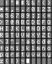
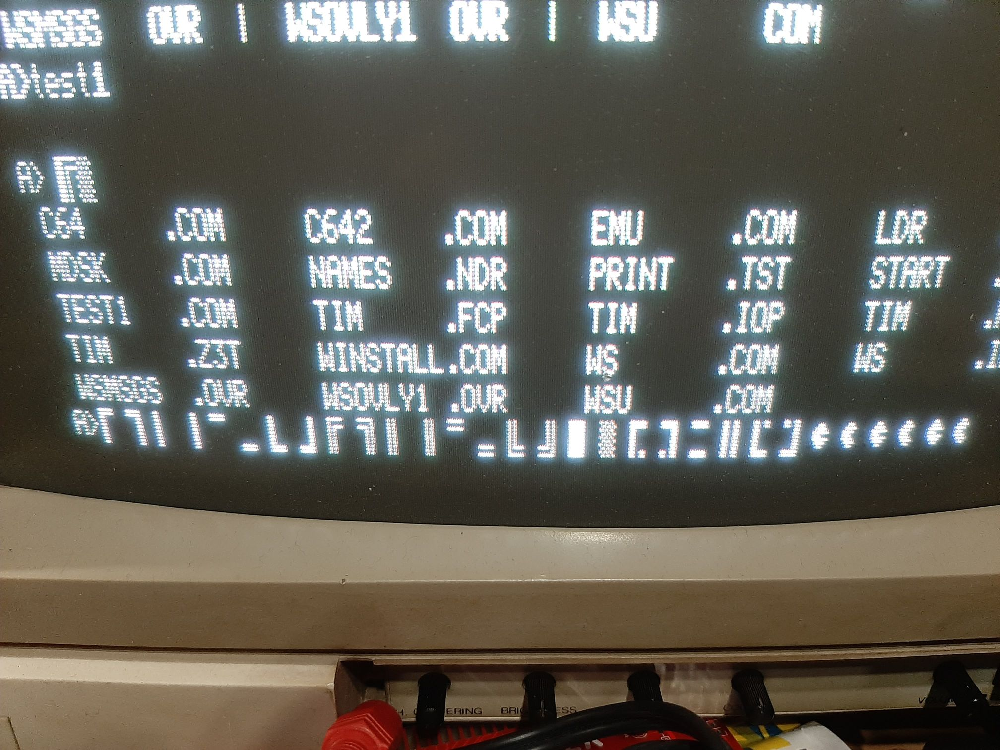
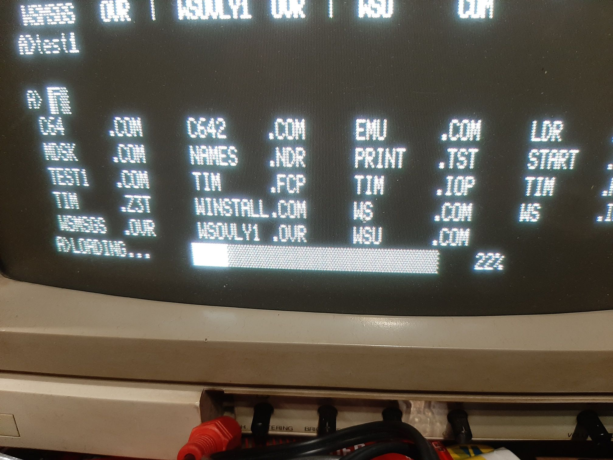

# tim011-tools

The home of various TIM-011 related projects. All code made by me is licensed under GPL 3 or later.

## timdisk

timdisk.sh is a BASH script that can extract, create and list TIM-011 floppy images. The script uses cpmtools package for this.

When extracting a floppy image, its contents is extracted into a directory with the following structure:
```
dirname/
dirname/1/
dirname/2/
...
```
User area 0 is extracted directly into directory, while other user areas are extracted into their own subdirectories. Same structure is used when creating floppy image from directory.

Script timdisk.sh uses the following files:
* diskdefs - definitions of SB180 floppy formats for cpmtools
* empty.img - initial empty image used for new image creation

For detailed usage, type:
```
timdisk.sh -h
```
Empty image that is provided is made with boot sector extracted using dsktools and may not be as clean as it could be. But, it is OK enough to recreate TIM system disk. Further investigation is required...

## TimFont

timfont.py is a Python 2/3 script that can extract a font used by TIM-011 into a PNG file, and also generate a COM file from PNG.

Be sure that program you use for editing PNG won't change its format: 1 byte per pixel, greyscale, no alpha channel, no layers or anything else.
Photoshop users should use the "Flatten Layers" option before saving their PNG file.
GIMP users should export the image as "8bpc GRAY".

When converting to COM file, white color is the only one recognised as character color, so be sure that you do not change the palette.

Currently, only two fonts for TIM-011 are known, one inside ASC.COM (English) and the other one inside CIR.COM (Serbian cyrilic).
To be able to generate COM file with new font, the script needs DEFAULT.COM that is also included here (this is just a copy of ASC.COM).



Each TIM-011 character is defined with 10 bytes.
Two lowest bits of each definition byte aren't used, so effective size is 6x10 pixels.
When generating PNG, those 2 lower bits are colored differently and should not be used for defining the characters.

Here are some examples of fonts done by Marko Šolajić:




## TimGraph Small C library

TimGraph is a graphics library for TIM-011 to be used with [MESCC / Mike's Enhanced Small C Compiler](https://github.com/MiguelVis/mescc) by Miguel García.

It has a routine for plotting pixels and several routines to handle 16x16 pixel tiles/sprites.
Beacuse TIM-011 uses 2 bits per pixel, one tile is 64 bytes.

Tile bytes are organized by columns because TIM-011 video memory is organized by columns:
```
    00  08  10  18
    01  09  11  19
    02  0A  12  1A
    03  0B  13  1B
    04  0C  14  1C
    05  0D  15  1D
    06  0E  16  1E
    07  0F  17  1F
```
Byte 00 holds pixels (0,0)-(3,0) and so on.

Library consists of these routines:

* plotxy (int x, int y, int col)
    * x = 0..511, y = 0..255, col = 0 ..3
    * plots pixel at specified coordinates
* scroll(n)
    * n = 0 .. 255
    * sets the value of TIM-011 scroll register at IO adress 00D0h
* ortile(x, y, addr)
    * x = 0 .. 127, y = 0 .. 63, addr 0-255 index based, or full address
    * puts tile from memory to screen using OR with current content
* gettile(x, y, addr)
    * x = 0 .. 127, y = 0 .. 63, addr 0-255 index based, or full address
    * gets tile from screen and stores in memory
* puttile(x, y, addr)
    * x = 0 .. 127, y = 0 .. 63, addr 0-255 index based, or full address
    * puts tile from memory to screen
* flptilex(addr)
    * addr 0-255 index based, or full address
    * flips tile pixels horizontaly
* flptiley(addr)
    * addr 0-255 index based, or full address
    * flips tile pixels vertically

Routines dealing with tiles have **addr** parameter.
That parameter can be index-based (select a tile from memory map of tiles), or it can be an address of a 64-byte buffer anywhere in memory.
If indexes are to be used, right after including this library an include with tile data must be placed, for example:
```
    #include <timgraph.lib>
    #include "sprites.h"
```
Tile data can be created using TimTile.

Examples of usage can be found in timexam.c, while sprites.h has sprite definitions from sprites.png.
You can compile it by using CP/M emulator and Small C compiler:
```
./cpm cc timexam
./cpm zsm timexam
./cpm hextocom timexam
./cpm
```
and then inside the emulator:
```
timexam
bye
```

TODO: line, circle, box, ... drawing routines

## TimTile

timtile.py is a Python 2/3 script that converts PNG files into TIM-011 tiles supported by its graphic library for Small C compiler.

Use provided template for drawing (sprites.png), or create your own.
Be sure that program you use for editing PNG won't change its format: 1 byte per pixel, greyscale, no alpha channel, no layers or anything else.
Photoshop users should use the "Flatten Layers" option before saving their PNG file.
GIMP users should export the image as "8bpc GRAY".

Only colors recognised as pixels are 40h, 80h and FFh which represent the colors 01b, 10b and 11b on TIM-011.
All other colors will be treated as black (00b).

For each PNG file a separate '.h' file with DB definitions of each tile will be created.
That file can be directly imported into Small C programs.

First tile is considered to be a color picker and it is not converted.
All tiles that consist of only black pixels also are not converted.

You can make PNG of any size, the program will go row by row of 16x16 tiles and do the conversion.

File 'sprites.png' contains some tile examples.
One sprite was taken from each of these ZX Spectrum games: Manic Miner, Ghosts'n'Goblins and Dizzy 1.

## CP/M emulator with TIM-011 video output simulation

I have found a wonderful CP/M emulator called [ANSI CP/M Emulator](https://github.com/jhallen/cpm) that enabled me to easy integrate simulation of TIM-011 video output.

Since that emulator emulates Z80 at full speed of host processor, pauses were introduced in video memory access, to kind-of simulate the speed of real TIM-011.
Take note that speed of emulator and real TIM-011 aren't the same.

Modified emulator can be found inside CPMEmulator directory.
To compile it, for now you'll need Linux and these libraries:

* for Debian/Ubuntu-based distributions: libx11-dev libxext-dev
* for Arch-based distributions: lib32-libx11 lib32-libxext

Window and video display code was taken from an old project of mine
(an assignment I gave to students a couple of years back, where thay had to implement iz x86 assembly basic pixel drawing functions into a video memory matrix, while I provided them with all the surrounding code for simulating such video output).

The modifications made to the emulator:

* main.c
    * emulator loop inside main() function was moved into separate function/thread
    * input() and output() functions were extended to check for TIM-011 video memory access
    * main() function is extended to handle X11 window manpulation and drawing
    * thread was added to handle X11 refreshing
* Makefile
    * linker options were added for required libraries

