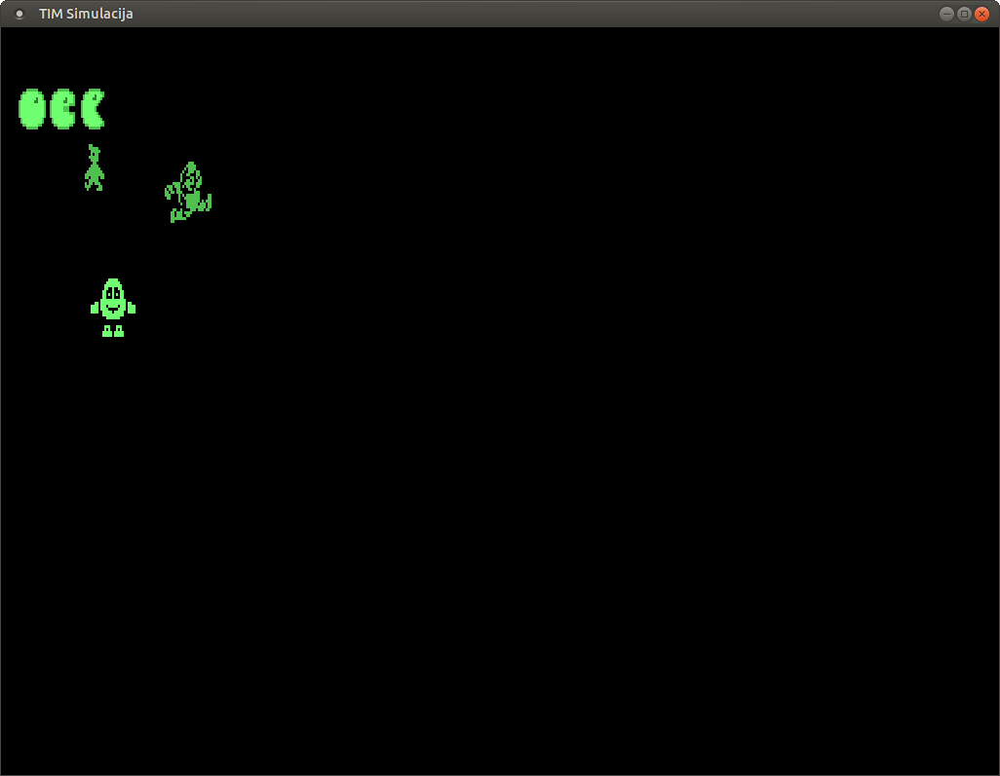
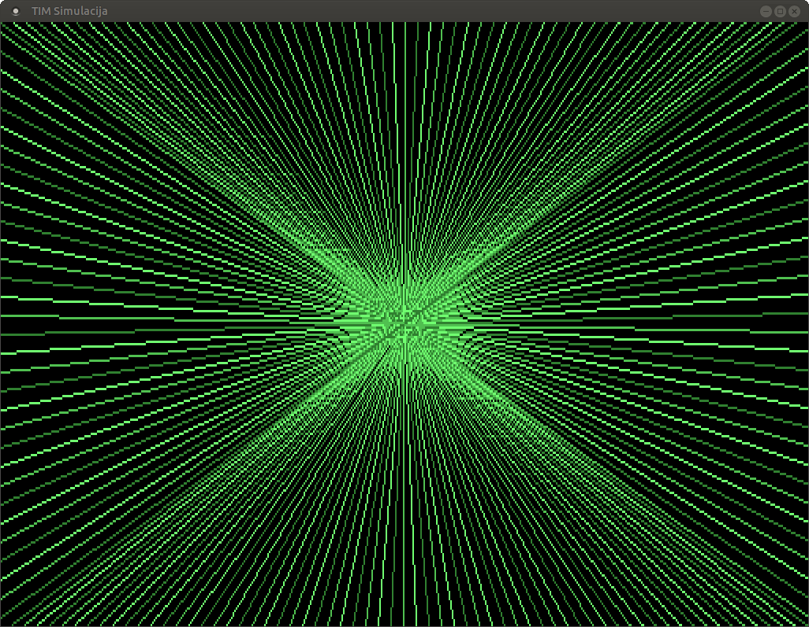
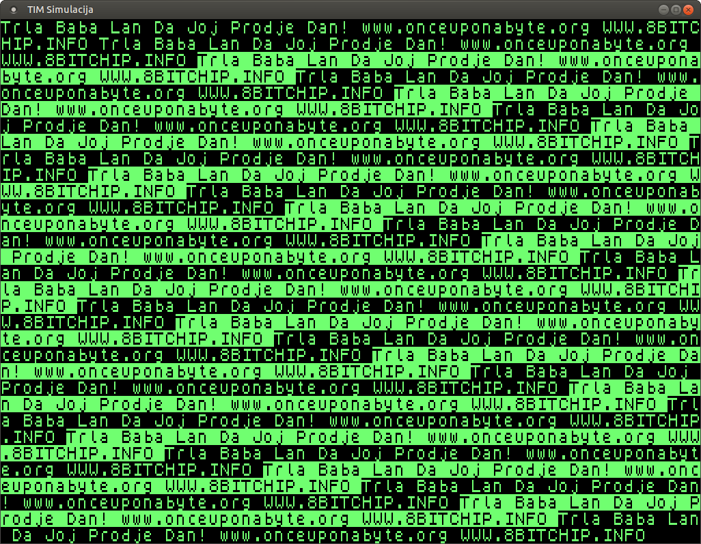

_This is a fork of https://bitbucket.org/zzarko/tim011-tools/, the original README
is way down below._

I was very impressed by zzarko's work on TIM-011 tools, not only because it's a
very impressive piece of work for a machine that I have fond memories of, but
also because TIM-011 is very near and dear to my heart, and over time I got
practically convinced that it had slipped into oblivion over the decades.

So when I saw that not only it's not forgotten, but that someone's actively
working on it, I wanted to contribute.  However, I'm lazy and found the lack of
automation off-putting, so I set off to fix this.

* I wanted to have a self-contained environment for TIM-011 tools.  This means
  automated download of all dependencies and such.  So I used `bazel` to take
  care of those dependencies, and took the trouble to make build rules for
  MESCC and SDCC to build and run the programs originally developed by
  zzarko@bitbucket.org.
* I wanted to use a standard C cross-compiler, instead of the custom C compiler
  that requires a Z80 emulator. So I added support for [SDCC][sdcc].
* I added automated building of the CP/M emulator, which will hopefully be
  useful for easy and scripted startup of the emulated code.
* Since the assembly syntax used by MESCC is not the same as that of SDCC, and
  since zzarko already wrote quite a bit of code using it, I also provided a
  MESCC toolchain.
* I left it to `bazel` to download and build all of the above tools.  This is
  ideal for those of you who are as lazy as I am: `bazel` takes over all the
  tedium of downloading the tools and making them ready for you. They are
  *not* installed on your system but are instead vendored as external
  dependencies, which means that they do not pollute your machine with random
  compiler tools.  This also means you can hack on the code for a while, then
  delete your working repository (or reinstall your machine, or change
  workspaces etc) and you can come back to an environment that still works.
  It's kind of nice.

To work with this repo, you will need to install one tool: [`bazel`][baz]. See
the install instructions from
https://docs.bazel.build/versions/main/install.html  Once you install `bazel`
and have it in your path, you can do a few things.  It's not much for the time
being, but it is a beginning.

From the top level directory:

```
bazel build //tests/hello
```

This command will build a `.com` program (a CP/M executable) which consists of
several source files, links a custom CP/M `crt0.s` (C runtime library) and is
compiled by [SDCC][sdcc] for the HD64180 processor.  You don't need to download
SDCC or any other tools: `bazel` will do that for you automatically.

[baz]: https://bazel.io
[sdcc]: http://sdcc.sourceforge.net

## MESCC

The original `tim011-tools` uses the MESCC compiler, which is cool, but has
some limitations:

1. It is not standard C.  It's a dedicated compiler for Z80 devices which makes
   your C programs look and feel nonstandard.  It has nonstandard requirements.
1. Its toolchain runs under the CP/M emulator.  This makes for a development
   environment that is very limited compared to what you have on your PC.

[mescc]: https://github.com/MiguelVis/mescc

I added some limited MESCC support.  You can try it out by running the following
in the project's top-level directory:

```
bazel build //prexam
```

You don't need to build or download anything: `bazel` will automatically download
and build MESCC for you.  After you run the above command, you will get a `.com`
file which you can submit for runnign under the TIM011 emulator.

You can build the emulator like so:

```
bazel build //CPMEmulator:cpm
```

Once you have both the `prexam.com` and the CP/M emulator, you can run `prexam`
like this, provided that you started from the project's top-level directory.

```
cd bazel-bin/prexam
../CPMEmulator/cpm prexam
```

This should show you the "trla baba lan" TIM-011 screen, proving that the
emulator works.

## Limitations

1. The toolchains work only under Linux.  Feel free to add support for other
   host OSes; I simply don't have anything but Linux to work on.
1. There isn't an easy way to run a program in an emulator just yet.  Once there is one,
   you will be able to do `bazel run //tests/hello_sim` or some such, and bazel
   will automatically compile your files, make an executable and run it under the
   TIM-011 emulator.
1. `bazel`, for all of its niceties, is still hard to use for those who don't
   buy into its philosophy.  Sorry about that - I like `bazel` since I've used it
   for work for the better part of the decade, and also wanted a pilot project
   that is simple enough for me to learn its internals.  The upshot here is that
   all the toolchain work is a one-time event: once the toolchain is ready, it
   is very simple to [build executable programs](tests/hello/BUILD.bazel).
1. The CP/M development environment built here is still not complete.  I have not
   verified that the generated `.com` files are usable.  The `crt0.s` is missing
   global initialization routines, which will likely need to be added.  While
   SDCC has most of the C standard library available for linking, it does not
   provide system-specific low level routines, which will need to be added too.

----
Original README.md follows.
----
# tim011-tools

The home of various TIM-011 related projects. All code made by me is licensed under GPL 3 or later.

## timdisk

timdisk.sh is a BASH script that can extract, create and list TIM-011 floppy images. The script uses cpmtools package for this.

When extracting a floppy image, its contents is extracted into a directory with the following structure:
```
dirname/
dirname/1/
dirname/2/
...
```
User area 0 is extracted directly into directory, while other user areas are extracted into their own subdirectories. Same structure is used when creating floppy image from directory.

Script timdisk.sh uses the following files:
* diskdefs - definitions of SB180 floppy formats for cpmtools
* empty.img - initial empty image used for new image creation

For detailed usage, type:
```
timdisk.sh -h
```
Empty image that is provided is made with boot sector extracted using dsktools and may not be as clean as it could be. But, it is OK enough to recreate TIM system disk. Further investigation is required...

## TimFont

timfont.py is a Python 2/3 script that can extract a font used by TIM-011 into a PNG file, and also generate a COM file from PNG.

Be sure that program you use for editing PNG won't change its format: 1 byte per pixel, greyscale, no alpha channel, no layers or anything else.
Photoshop users should use the "Flatten Layers" option before saving their PNG file.
GIMP users should export the image as "8bpc GRAY".

When converting to COM file, white color is the only one recognised as character color, so be sure that you do not change the palette.

Currently, only two fonts for TIM-011 are known, one inside ASC.COM (English) and the other one inside CIR.COM (Serbian cyrilic).
To be able to generate COM file with new font, the script needs DEFAULT.COM that is also included here (this is just a copy of ASC.COM).


Each TIM-011 character is defined with 10 bytes.
Two lowest bits of each definition byte aren't used, so effective size is 6x10 pixels.
When generating PNG, those 2 lower bits are colored differently and should not be used for defining the characters.

Here are some examples of fonts done by Marko Šolajić:


## TimTile

timtile.py is a Python 2/3 script that converts PNG files into TIM-011 tiles supported by its graphic library for Small C compiler.

Use provided template for drawing (sprites.png), or create your own.
Be sure that program you use for editing PNG won't change its format: 1 byte per pixel, greyscale, no alpha channel, no layers or anything else.
Photoshop users should use the "Flatten Layers" option before saving their PNG file.
GIMP users should export the image as "8bpc GRAY".

Only colors recognised as pixels are 40h, 80h and FFh which represent the colors 01b, 10b and 11b on TIM-011.
All other colors will be treated as black (00b).

For each PNG file a separate '.h' file with DB definitions of each tile will be created.
That file can be directly imported into Small C programs.

First tile is considered to be a color picker and it is not converted.
All tiles that consist of only black pixels also are not converted.

You can make PNG of any size, the program will go row by row of 16x16 tiles and do the conversion.

File 'sprites.png' contains some tile examples.
One sprite was taken from each of these ZX Spectrum games: Manic Miner, Ghosts'n'Goblins and Dizzy 1.

## TimGraph Small C library

 

TimGraph is a graphics library for TIM-011 to be used with [MESCC / Mike's Enhanced Small C Compiler](https://github.com/MiguelVis/mescc) by Miguel García.

It has a routine for plotting pixels and several routines to handle 16x16 pixel tiles/sprites.
Beacuse TIM-011 uses 2 bits per pixel, one tile is 64 bytes.

Tile bytes are organized by columns because TIM-011 video memory is organized by columns:
```
    00  10  20  30
    01  11  21  31
    02  12  22  32
    ..  ..  ..  ..
    ..  ..  ..  ..
    0D  1D  2D  3D
    0E  1E  2E  3E
    0F  1F  2F  3F
```
Byte 00 holds pixels (0,0)-(3,0) and so on.

Library consists of these routines:

* plotxy (x, y, col) (Z80 assembly)
    * x = 0..511, y = 0..255, col = 0 ..3
    * plots pixel at specified coordinates
    * does not check for out-of-screen values!
* line(col, x0, y0, x1, y1) (Z80 assembly)
    * x0,x1 = 0..511, y0,y1 = 0..255, col = 0 ..3
    * draws a line using a Bresenham algorithm from https://github.com/MiguelVis/xpcw/blob/master/xdraw.h
    * does not check for out-of-screen values!
* circle(x, y, radius, col) (Small C)
    * x = 0..511, y = 0..255, radius = 1..127, col = 0 ..3
    * draws a circle at specified coordinates, copied from https://github.com/MiguelVis/xpcw/blob/master/xdraw.h
    * does not check for out-of-screen values!
* box(x0, y0, x1, y1, col) (Small C)
    * x0,x1 = 0..511, y0,y1 = 0..255, col = 0 ..3
    * draws a box
    * does not check for out-of-screen values!
* scroll(n) (Z80 assembly)
    * n = 0 .. 255
    * sets the value of TIM-011 scroll register at IO adress 00D0h
* ortile(x, y, addr) (Z80 assembly)
    * x = 0 .. 127, y = 0 .. 63, addr 0-255 index based, or full address
    * puts tile from memory to screen using OR with current content
    * does not check for out-of-screen values!
* gettile(x, y, addr) (Z80 assembly)
    * x = 0 .. 127, y = 0 .. 63, addr 0-255 index based, or full address
    * gets tile from screen and stores in memory
    * does not check for out-of-screen values!
* puttile(x, y, addr) (Z80 assembly)
    * x = 0 .. 127, y = 0 .. 63, addr 0-255 index based, or full address
    * puts tile from memory to screen
    * does not check for out-of-screen values!
* flptilex(addr) (Z80 assembly)
    * addr 0-255 index based, or full address
    * flips tile pixels horizontaly
* flptiley(addr) (Z80 assembly)
    * addr 0-255 index based, or full address
    * flips tile pixels vertically

Routines dealing with tiles have **addr** parameter.
That parameter can be index-based (select a tile from memory map of tiles), or it can be an address of a 64-byte buffer anywhere in memory.
If indexes are to be used, right after including this library an include with tile data must be placed, for example:
```
    #include <timgraph.lib>
    #include "sprites.h"
```
Tile data can be created using TimTile.

Examples of usage can be found in timexam.c, while sprites.h has sprite definitions from sprites.png.
You can compile it by using CP/M emulator and Small C compiler:
```
./cpm cc timexam
./cpm zsm timexam
./cpm hextocom timexam
./cpm
```
and then inside the emulator:
```
timexam
bye
```

## TimFont8

timfont8.py is a Python 2/3 script that can convert PNG of ZX Spectrum 8x8 font into TIM-011 font used with TIM's Small C print library.

Be sure that program you use for editing PNG won't change its format: 1 byte per pixel, greyscale, no alpha channel, no layers or anything else.
Photoshop users should use the "Flatten Layers" option before saving their PNG file.
GIMP users should export the image as "8bpc GRAY".

Only colors recognised as pixels are 40h, 80h and FFh which represent the colors 01b, 10b and 11b on TIM-011.
All other colors will be treated as black (00b).

For each PNG file a separate '.h' file with DB definitions of each character will be created.
That file can be directly imported into Small C programs.

You can make PNG of any size, the program will go row by row of 8x8 characters and do the conversion.

Example file 'zxchars.png' contains ZX Spectrum font.

## TimPrint Small C 8x8 font library



TimPrint is a character library that uses 8x8 characters for its output, to be used with [MESCC / Mike's Enhanced Small C Compiler](https://github.com/MiguelVis/mescc) by Miguel García.
This gives resolution of 64x32 character positions. Fonts can be monochrome, but all 4 shades can be used in their definition.

One character is 16 bytes, and font can contain up to 256 of them.
Character bytes are organized in two columns because TIM-011 video memory is organized by columns:
```
    00  08
    01  09
    02  0A
    03  0B
    04  0C
    05  0D
    06  0E
    07  0F
```
Library consists of these routines:

* prchrxy(x, y, chr)
    * x = 0 .. 63, y = 0 .. 31, chr 0-255 
    * puts character to screen and updates cursor position
    * does not check for out-of-screen values!
* prstr(str)
    * prints null-terminated string at current cursor position
    * will wrap to position (0,0) after (63,31)
* cursorxy(x, y)
    * x = 0 .. 63, y = 0 .. 31
    * sets cursor position
    * does not check for out-of-screen values!
* prsetinv(xor)
    * xor=0x800 - normal drawing,  xor=0x8FF - inverted drawing (high part must be 8!)
    * sets XOR value for character drawing
* prsetsub(sub)
    * sub=0x20 - ASCII coding,  sub=0 - no coding
    * sets the value to be substracted from character code before printing

In standard mode, before printing, each character ASCII code is substracted by 0x20, and then font data is indexed with this value.
This is useful for printing ASCII strings.

That constant can be changed, for example to 0, and then font data can be used in indexed mode, and full 256 charactes can be used.
Be aware that prstr function won't be able to use character at index 0 because that value is used as string terminator.

Also, in standard mode characters are drawn non-inverted.
If XOR constant is set to 0x8FF, characters will be printed inverted.

For the library to work, font file must be included right after including this library, for example:
```
    #include <timgraph.lib>
    #include "zxchars.h"
```
Font data can be created using TimFont8.

Examples of usage can be found in prexam.c, while zxchars.h has character definitions from zxchars.png.
You can compile it by using CP/M emulator and Small C compiler:
```
./cpm cc prexam
./cpm zsm prexam
./cpm hextocom prexam
./cpm
```
and then inside the emulator:
```
prexam
bye
```

## CP/M emulator with TIM-011 video output simulation

I have found a wonderful CP/M emulator called [ANSI CP/M Emulator](https://github.com/jhallen/cpm) that enabled me to easy integrate simulation of TIM-011 video output.

Since that emulator emulates Z80 at full speed of host processor, pauses were introduced in video memory access, to kind-of simulate the speed of real TIM-011.
Take note that speed of emulator and real TIM-011 aren't the same.

Modified emulator can be found inside CPMEmulator directory.
To compile it, for now you'll need Linux and these libraries:

* for Debian/Ubuntu-based distributions: libx11-dev libxext-dev
* for Arch-based distributions: lib32-libx11 lib32-libxext

Window and video display code was taken from an old project of mine
(an assignment I gave to students a couple of years back, where thay had to implement iz x86 assembly basic pixel drawing functions into a video memory matrix, while I provided them with all the surrounding code for simulating such video output).

The modifications made to the emulator:

* main.c
    * emulator loop inside main() function was moved into separate function/thread
    * input() and output() functions were extended to check for TIM-011 video memory access
    * main() function is extended to handle X11 window manpulation and drawing
    * thread was added to handle X11 refreshing
* Makefile
    * linker options were added for required libraries

